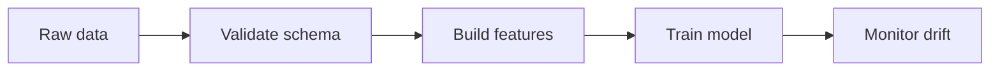

# Curriculum Lesson Updater

## Overview

Use this skill to update curriculum lessons in a scoped, launch-ready way. The expected output is a set of rich Docusaurus Markdown lessons with verified visual media near the top, diagrams, math, runnable examples, exercises, and a clean build.

## Workflow

1. Scope the work first.
   - Update only the requested track, level, section, or lesson.
   - Do not sweep the whole curriculum unless the user explicitly asks.
   - Preserve front matter fields such as `id`, `title`, `track`, and `level`; bump `version` when materially rewriting a lesson.

2. Audit the existing lessons.
   - List files in scope with `rg --files` or `Get-ChildItem`.
   - Search for existing `## Video`, `## Watch First`, `iframe`, `youtube.com/embed`, `mermaid`, `$$`, and code fences.
   - Search for corruption and placeholders: `â`, `€`, `™`, `[web:`, and broken citation fragments like `[1][2]`.

3. Research only for the scoped lessons.
   - Browse when the user asks to research, update, verify, or use current/valid sources.
   - Prefer primary sources for technical claims: official docs, original papers, standards, or project documentation.
   - Use videos as visual support, not as the sole technical source.

4. Verify videos before embedding.
   - Choose videos that directly illustrate the lesson topic.
   - Verify each YouTube ID with oEmbed or an equivalent metadata check; a `200` response is the minimum acceptance gate.
   - Replace broken, unavailable, irrelevant, placeholder, or generic videos.
   - Never leave placeholder IDs such as unrelated reused videos.

5. Put videos at the top of the page.
   - Use `## Watch First` as the first content after the lesson `# H1`.
   - Place it before `## Learning Objectives` unless the user explicitly asks for a different order.
   - Use a responsive iframe block:

```mdx
## Watch First

<div style={{position: 'relative', paddingBottom: '56.25%', height: 0, overflow: 'hidden', maxWidth: '100%', marginBottom: '1.5rem'}}>
  <iframe
    src="https://www.youtube.com/embed/VIDEO_ID"
    title="Descriptive video title"
    style={{position: 'absolute', top: 0, left: 0, width: '100%', height: '100%', border: 0}}
    allow="accelerometer; autoplay; clipboard-write; encrypted-media; gyroscope; picture-in-picture; web-share"
    referrerPolicy="strict-origin-when-cross-origin"
    allowFullScreen
  />
</div>
```

## Lesson Quality Bar

Each updated lesson should usually include:

- Clear learning objectives.
- A visual map or workflow diagram in Mermaid near the top.
- Concept explanations that are specific to the lesson, not generic filler.
- Rendered math with `$$ ... $$` for formulas where the topic benefits from it.
- Runnable code examples with complete imports and self-contained toy data.
- Practical exercises and a self-assessment.
- Further reading with official docs, papers, or trustworthy primary references.
- Pitfalls, tradeoffs, or launch-readiness notes for applied lessons.

## Mermaid Guidance

Use Mermaid to explain structure, pipelines, loops, architectures, and decision flows.

- Prefer `flowchart`, `sequenceDiagram`, `graph`, or `mindmap` when they genuinely clarify the lesson.
- Quote labels when they contain punctuation, parentheses, or multiple words.
- Keep diagrams readable; do not turn the entire lesson into one huge graph.

Example:



## Math Guidance

Use math when it explains the core idea, not as decoration.

- Prefer display math with `$$` so KaTeX renders it.
- Define every symbol in plain language after the formula.
- Avoid formulas that are too advanced for the lesson level unless the level is advanced and the surrounding explanation supports them.

## Code Guidance

Code snippets should be copy-paste plausible.

- Include imports.
- Use synthetic or tiny inline data when possible.
- Avoid hidden local imports unless the snippet explicitly creates that file.
- Avoid malformed placeholders like `[1][2][3]`, empty arrays, or broken pandas expressions.
- Prefer small examples that teach the concept over large framework demos.

## Docusaurus Safety

Before finishing, run or at least attempt:

```powershell
npm.cmd run typecheck
npm.cmd run build
```

Run from the Docusaurus site directory, usually `website`.

Also scan the scoped files:

```powershell
rg -n "â|€|™|\[web:|\[[0-9]+\]\[[0-9]+\]|## Video" <scoped-path>
Get-ChildItem -Path <scoped-path> -Recurse -File | Select-String -Pattern 'src="https://www.youtube.com/embed/'
```

For top placement, confirm `## Watch First` appears before `## Learning Objectives` in each updated lesson.

## Final Report

In the final response, keep it concise:

- State the exact scope updated.
- Mention video verification and whether any broken videos were replaced.
- Mention `typecheck` and `build` results, including non-blocking warnings if present.
- Provide source links used for videos and important technical references.
- Do not push, commit, or stage unless the user asks.
