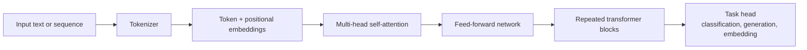
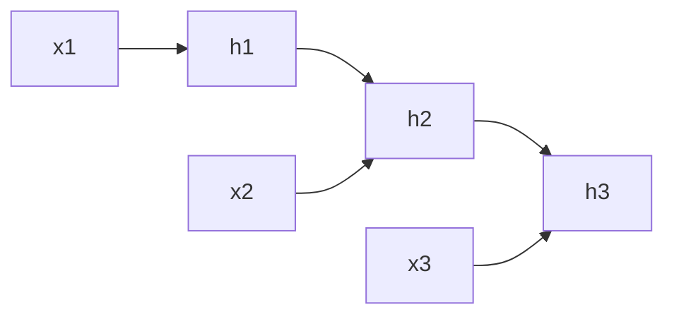
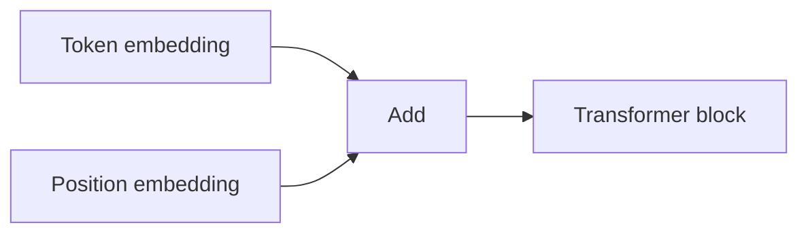
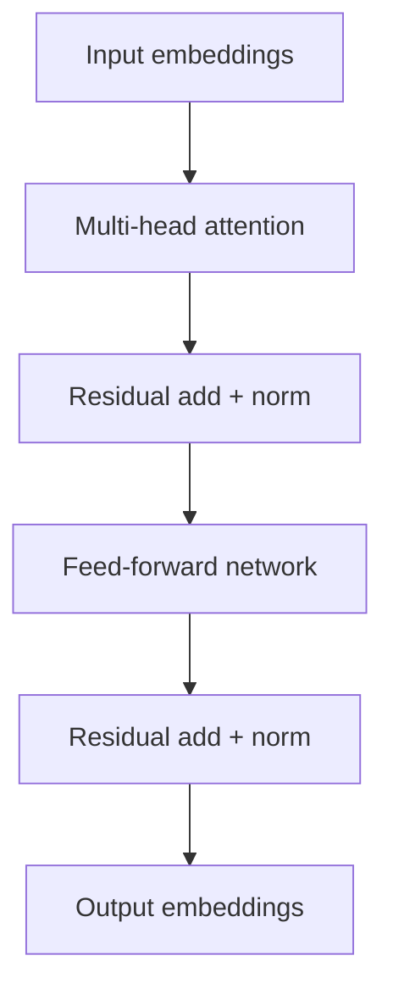

# Transformers

## Watch First

<div style={{position: 'relative', paddingBottom: '56.25%', height: 0, overflow: 'hidden', maxWidth: '100%', marginBottom: '1.5rem'}}>
  <iframe
    src="https://www.youtube.com/embed/wjZofJX0v4M"
    title="But what is a GPT? Visual intro to transformers"
    style={{position: 'absolute', top: 0, left: 0, width: '100%', height: '100%', border: 0}}
    allow="accelerometer; autoplay; clipboard-write; encrypted-media; gyroscope; picture-in-picture; web-share"
    referrerPolicy="strict-origin-when-cross-origin"
    allowFullScreen
  />
</div>

## Learning Objectives

By the end of this lesson, you will be able to:

- Explain how transformers replace recurrence with attention over tokens.
- Derive the intuition behind scaled dot-product attention.
- Compare encoder-only, decoder-only, and encoder-decoder transformer patterns.
- Implement a small attention calculation and know when a transformer is the right tool.

## Architecture Map



Transformers are sequence models built around attention. Instead of processing tokens one step at a time like an RNN, a transformer lets each token compare itself with other tokens in the sequence.

That single idea unlocked models that can handle long context, train in parallel, and transfer across tasks.

:::tip Launch Rule
Use transformers when sequence context is central to the task. For small tabular problems, start with simpler models first.
:::

## Why Transformers Replaced Many RNN Workflows

RNNs, LSTMs, and GRUs process sequences step by step:



That design has two practical limits:

- training is harder to parallelize,
- long-range dependencies can fade as information moves through many steps.

Transformers use attention so every token can directly inspect the rest of the context.

## Self-Attention

Self-attention turns each token embedding into three vectors:

- Query `Q`: what this token is looking for,
- Key `K`: what this token offers for matching,
- Value `V`: the information this token contributes.

The attention formula is:

$$
Attention(Q, K, V) = softmax\left(\frac{QK^T}{\sqrt{d_k}}\right)V
$$

Read it as:

1. Compare queries with keys.
2. Scale scores by the key dimension.
3. Convert scores into weights with softmax.
4. Use those weights to mix the value vectors.

## Attention From Scratch

This small NumPy example computes scaled dot-product attention for three token embeddings.

```python
import numpy as np

def softmax(x, axis=-1):
    x = x - np.max(x, axis=axis, keepdims=True)
    exp_x = np.exp(x)
    return exp_x / exp_x.sum(axis=axis, keepdims=True)

tokens = np.array([
    [1.0, 0.0, 1.0, 0.0],
    [0.0, 2.0, 0.0, 2.0],
    [1.0, 1.0, 1.0, 1.0],
])

rng = np.random.default_rng(42)
W_q = rng.normal(size=(4, 4))
W_k = rng.normal(size=(4, 4))
W_v = rng.normal(size=(4, 4))

Q = tokens @ W_q
K = tokens @ W_k
V = tokens @ W_v

scores = Q @ K.T / np.sqrt(K.shape[-1])
weights = softmax(scores)
contextual_tokens = weights @ V

print("attention weights")
print(np.round(weights, 3))
print("contextual embeddings")
print(np.round(contextual_tokens, 3))
```

The output embeddings are contextual: each token representation now includes weighted information from the other tokens.

## Multi-Head Attention

One attention head learns one kind of relationship. Multiple heads let the model learn several relationship patterns in parallel.

$$
MultiHead(Q, K, V) = Concat(head_1, \dots, head_h)W^O
$$

where each head is:

$$
head_i = Attention(QW_i^Q, KW_i^K, VW_i^V)
$$

In language, one head might focus on subject-verb agreement, another on coreference, and another on local syntax. The model learns these patterns from data.

## Positional Information

Attention alone does not know token order. Transformers add positional information to token embeddings.



Without positional information, "mentor helps learner" and "learner helps mentor" would look too similar.

## Transformer Block

A standard transformer block includes:

- multi-head attention,
- residual connections,
- layer normalization,
- feed-forward network.



The feed-forward network is applied to each token position independently after attention has mixed contextual information.

## Encoder, Decoder, and Decoder-Only Patterns

| Pattern | Attention behavior | Common use |
| --- | --- | --- |
| Encoder-only | Bidirectional attention over input | classification, retrieval, embeddings |
| Decoder-only | Causal attention over previous tokens | text/code generation |
| Encoder-decoder | Encoder reads input, decoder generates output | translation, summarization |

### Encoder-Only

Encoder-only models are strong when you need a representation of a full input.

Examples:

- classify a governance proposal,
- embed a lesson for semantic search,
- detect whether a support message needs escalation.

### Decoder-Only

Decoder-only models predict the next token.

$$
P(x_1, \dots, x_T) = \prod_{t=1}^{T}P(x_t \mid x_{<t})
$$

This is the pattern behind many generative LLMs.

### Encoder-Decoder

Encoder-decoder models are useful when the output is a new sequence conditioned on an input sequence.

Examples:

- translate text,
- summarize long notes,
- convert a rough project brief into structured documentation.

## Minimal Transformers Library Example

Install dependencies:

```bash
pip install transformers torch
```

Run a small embedding extraction:

```python
import torch
from transformers import AutoModel, AutoTokenizer

model_name = "distilbert-base-uncased"
tokenizer = AutoTokenizer.from_pretrained(model_name)
model = AutoModel.from_pretrained(model_name)

text = "Flow Research builders learn machine learning in public."
inputs = tokenizer(text, return_tensors="pt")

with torch.no_grad():
    outputs = model(**inputs)

last_hidden_state = outputs.last_hidden_state
cls_embedding = last_hidden_state[:, 0, :]

print(last_hidden_state.shape)
print(cls_embedding.shape)
```

The `last_hidden_state` contains contextual embeddings for each token.

## When Transformers Are Worth It

Use a transformer when:

- order and context matter,
- long-range relationships matter,
- text, code, logs, or sequences are central,
- transfer learning from a pretrained model saves data and time.

Be cautious when:

- the dataset is small and tabular,
- latency or cost is tight,
- interpretability is more important than raw capability,
- a simpler model already meets the product need.

## Practical Exercises

### Exercise 1: Inspect Attention

Run the NumPy attention example and change the token vectors. Observe how the attention weights change.

### Exercise 2: Compare Model Families

For three tasks, choose encoder-only, decoder-only, encoder-decoder, or no transformer:

- proposal classification,
- learner-support chatbot,
- weekly metric forecast.

### Exercise 3: Extract Embeddings

Use the Transformers library example and compare embeddings for two similar sentences.

## Self-Assessment

Rate yourself from 1 to 5:

- I can explain self-attention without mysticism.
- I can read the scaled dot-product attention formula.
- I can distinguish encoder-only, decoder-only, and encoder-decoder designs.
- I can decide when a transformer is worth the complexity.

## Further Reading

- [Attention Is All You Need](https://arxiv.org/abs/1706.03762)
- [The Illustrated Transformer](https://jalammar.github.io/illustrated-transformer/)
- [Hugging Face Transformers documentation](https://huggingface.co/docs/transformers/index)

## Next Steps

Next, study graph neural networks. Transformers model dense relationships inside sequences; GNNs model explicit relationships between entities.
