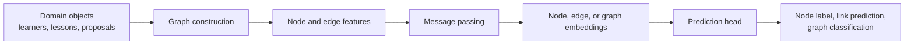
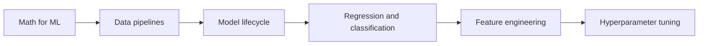

# Graph Neural Networks

## Watch First

<div style={{position: 'relative', paddingBottom: '56.25%', height: 0, overflow: 'hidden', maxWidth: '100%', marginBottom: '1.5rem'}}>
  <iframe
    src="https://www.youtube.com/embed/xFMhLp52qKI"
    title="Graph Neural Networks: A gentle introduction"
    style={{position: 'absolute', top: 0, left: 0, width: '100%', height: '100%', border: 0}}
    allow="accelerometer; autoplay; clipboard-write; encrypted-media; gyroscope; picture-in-picture; web-share"
    referrerPolicy="strict-origin-when-cross-origin"
    allowFullScreen
  />
</div>

## Learning Objectives

By the end of this lesson, you will be able to:

- Represent relational ML problems as nodes, edges, and features.
- Explain message passing and neighborhood aggregation.
- Compare GCN, GAT, and GraphSAGE-style models.
- Implement a small graph aggregation step and decide when a GNN is justified.

## Graph Learning Map



Many ML problems are not just rows or sequences. They are networks.

A graph neural network learns from entities and the relationships between them. In a Flow Research-style system, this might mean learners connected to lessons, contributors connected to proposals, or services connected through dependencies.

:::tip Launch Rule
Reach for a GNN when the edges are meaningful. If the links are arbitrary or weak, a simpler tabular or sequence model may be better.
:::

## Graph Basics

A graph is usually written:

$$
G = (V, E)
$$

where:

- `V` is a set of nodes,
- `E` is a set of edges.

Nodes can have feature vectors:

$$
x_v \in \mathbb{R}^d
$$

Edges can also have attributes:

- type,
- weight,
- timestamp,
- direction.

## Example: Learning Path Graph



In this graph:

- lessons are nodes,
- prerequisite relationships are edges,
- node features can include difficulty, topic, estimated time, or completion rate.

A GNN could learn lesson embeddings that understand both content and position in the curriculum.

## Message Passing

The core GNN operation is message passing.

For node `v`, the model gathers information from its neighbors:

$$
h_v^{(k+1)} = UPDATE\left(h_v^{(k)}, AGGREGATE\left(\{h_u^{(k)} : u \in N(v)\}\right)\right)
$$

Read it as:

1. Look at the current node embedding.
2. Collect neighbor embeddings.
3. Aggregate them with mean, sum, max, or attention.
4. Update the node embedding.

After one layer, each node knows about immediate neighbors. After two layers, it can include neighbors-of-neighbors.

## Message Passing From Scratch

This pure NumPy example performs one neighborhood aggregation step.

```python
import numpy as np

# Nodes: 0=Math, 1=Pipelines, 2=Lifecycle, 3=Regression
adjacency = np.array([
    [1, 1, 0, 0],
    [1, 1, 1, 0],
    [0, 1, 1, 1],
    [0, 0, 1, 1],
], dtype=float)

features = np.array([
    [1.0, 0.0],  # math-heavy
    [0.8, 0.4],  # data-heavy
    [0.4, 0.8],  # lifecycle-heavy
    [0.9, 0.7],  # modeling-heavy
])

degree = adjacency.sum(axis=1, keepdims=True)
neighbor_mean = adjacency @ features / degree

W = np.array([
    [0.7, -0.2],
    [0.3, 0.8],
])

new_embeddings = np.maximum(0, neighbor_mean @ W)

print(np.round(new_embeddings, 3))
```

This is not a full GNN training loop, but it shows the central operation: each node is updated from its neighborhood.

## Common GNN Families

### Graph Convolutional Networks

GCNs use normalized neighbor aggregation. A common update pattern is:

$$
H^{(k+1)} = \sigma(\tilde{D}^{-\frac{1}{2}}\tilde{A}\tilde{D}^{-\frac{1}{2}}H^{(k)}W^{(k)})
$$

where:

- `A` is the adjacency matrix,
- `D` is the degree matrix,
- `H` is the node embedding matrix,
- `W` is a learned weight matrix.

GCNs are a strong baseline for node classification and graph representation.

### Graph Attention Networks

GATs learn how much attention each neighbor deserves.

$$
h_v' = \sum_{u \in N(v)} \alpha_{vu}Wh_u
$$

where `alpha` is a learned attention weight.

Use attention when some neighbors matter more than others.

### GraphSAGE-Style Models

GraphSAGE samples neighborhoods and learns aggregators. This helps scale to large graphs where using every neighbor is expensive.

Use GraphSAGE-style approaches when:

- graphs are large,
- nodes have many neighbors,
- new nodes arrive over time.

## Task Types

| Task | What the model predicts | Example |
| --- | --- | --- |
| Node classification | Label for each node | learner risk, lesson difficulty |
| Link prediction | Whether an edge should exist | mentor match, related lesson |
| Graph classification | Label for whole graph | proposal quality, workflow risk |
| Node regression | Numeric value for each node | expected completion score |

## GNNs vs. Transformers

Transformers and GNNs both move information between elements, but they start from different assumptions.

| Model | Relationship structure | Best fit |
| --- | --- | --- |
| Transformer | Dense attention over tokens | text, code, sequence context |
| GNN | Explicit graph edges | networks, dependencies, relational data |

A transformer can be seen as using attention over a mostly dense graph of tokens. A GNN usually respects explicit edges.

## Practical Design Checklist

Before building a GNN, answer:

- What are the nodes?
- What are the edges?
- Are edges directed or undirected?
- Are there edge types or weights?
- What features are available at prediction time?
- Is the task node-level, edge-level, or graph-level?
- What baseline will you compare against?

If you cannot define meaningful edges, the GNN probably has no useful graph to learn from.

## Practical Exercises

### Exercise 1: Build a Graph Schema

Choose a Flow Research-style system and define nodes, edges, features, and prediction target.

### Exercise 2: Run the NumPy Aggregator

Modify the adjacency matrix and observe how node embeddings change.

### Exercise 3: Compare Against a Baseline

For your graph problem, write down a non-GNN baseline and explain what the graph is expected to add.

## Self-Assessment

Rate yourself from 1 to 5:

- I can represent a domain as a graph.
- I can explain message passing.
- I can compare GCNs, GATs, and GraphSAGE.
- I can decide whether graph structure is meaningful enough for a GNN.

## Further Reading

- [Semi-Supervised Classification with Graph Convolutional Networks](https://arxiv.org/abs/1609.02907)
- [Graph Attention Networks](https://arxiv.org/abs/1710.10903)
- [Inductive Representation Learning on Large Graphs](https://arxiv.org/abs/1706.02216)
- [PyTorch Geometric documentation](https://pytorch-geometric.readthedocs.io/)

## Next Steps

Next, study reinforcement learning. GNNs learn from relationships; RL learns from interaction and feedback over time.
