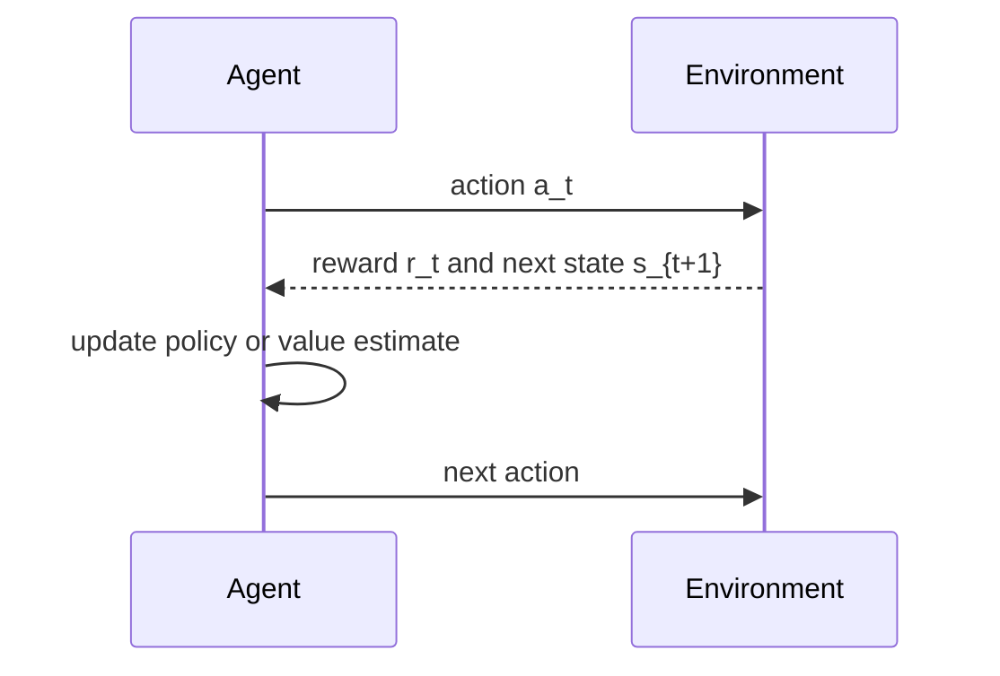
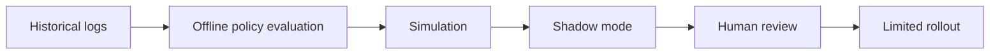

# Reinforcement Learning

## Watch First

<div style={{position: 'relative', paddingBottom: '56.25%', height: 0, overflow: 'hidden', maxWidth: '100%', marginBottom: '1.5rem'}}>
  <iframe
    src="https://www.youtube.com/embed/1OI0uuz9jkI"
    title="Intro to Reinforcement Learning Made Simple"
    style={{position: 'absolute', top: 0, left: 0, width: '100%', height: '100%', border: 0}}
    allow="accelerometer; autoplay; clipboard-write; encrypted-media; gyroscope; picture-in-picture; web-share"
    referrerPolicy="strict-origin-when-cross-origin"
    allowFullScreen
  />
</div>

## Learning Objectives

By the end of this lesson, you will be able to:

- Explain reinforcement learning as sequential decision-making under feedback.
- Define agent, environment, state, action, reward, policy, value, and return.
- Implement a small tabular Q-learning loop.
- Decide when RL is appropriate and when supervised learning or rules are safer.

## Agent-Environment Loop



Reinforcement learning is about learning what to do through interaction.

In supervised learning, the model learns from labeled examples. In RL, an agent takes actions, observes rewards, and improves a policy over time.

:::warning Launch Rule
Do not test risky RL behavior directly on real users. Start with simulation, offline evaluation, guardrails, and human review.
:::

## Core Concepts

| Concept | Meaning | Flow-style example |
| --- | --- | --- |
| Agent | Learner that chooses actions | recommendation policy |
| Environment | System the agent interacts with | learning platform |
| State | Current situation | learner progress and recent activity |
| Action | Choice available to the agent | recommend lesson, ask mentor, wait |
| Reward | Feedback signal | completion, mastery, healthy engagement |
| Policy | Rule for choosing actions | `pi(a | s)` |
| Value | Expected future return | how promising a state or action is |

At timestep `t`:

$$
s_t \rightarrow a_t \rightarrow r_t, s_{t+1}
$$

The goal is to learn a policy that maximizes expected cumulative reward.

## Return and Discounting

The return from timestep `t` is:

$$
G_t = r_t + \gamma r_{t+1} + \gamma^2r_{t+2} + \dots
$$

where `gamma` is the discount factor.

- `gamma` near `0` values immediate reward.
- `gamma` near `1` values long-term outcomes.

In learning systems, long-term mastery may matter more than immediate clicks. That means reward design is not just math; it encodes product values.

## Value Functions

The state-value function estimates how good it is to be in a state:

$$
V^\pi(s) = \mathbb{E}_\pi[G_t \mid s_t = s]
$$

The action-value function estimates how good it is to take action `a` in state `s`:

$$
Q^\pi(s, a) = \mathbb{E}_\pi[G_t \mid s_t = s, a_t = a]
$$

Many RL algorithms learn or approximate `Q(s, a)`.

## Exploration vs. Exploitation

The agent must balance:

- exploitation: choose the action that currently looks best,
- exploration: try actions that might teach the agent something new.

Epsilon-greedy action selection is a simple strategy:

$$
a =
\begin{cases}
\text{random action} & \text{with probability } \epsilon \\
\arg\max_a Q(s,a) & \text{otherwise}
\end{cases}
$$

Exploration is useful in simulation. In real products, exploration needs safety constraints.

## Q-Learning

Q-learning updates an estimate of action value:

$$
Q(s,a) \leftarrow Q(s,a) + \alpha \left[r + \gamma \max_{a'}Q(s',a') - Q(s,a)\right]
$$

where:

- `alpha` is the learning rate,
- `gamma` is the discount factor,
- `s'` is the next state.

## Q-Learning From Scratch

This tiny environment is a one-dimensional path. The agent starts at position `0` and gets reward when it reaches the final position.

```python
import numpy as np

n_states = 6
n_actions = 2  # 0=left, 1=right
terminal_state = n_states - 1

Q = np.zeros((n_states, n_actions))
rng = np.random.default_rng(42)

alpha = 0.2
gamma = 0.95
epsilon = 0.2
episodes = 500

def step(state, action):
    if action == 1:
        next_state = min(state + 1, terminal_state)
    else:
        next_state = max(state - 1, 0)

    reward = 1.0 if next_state == terminal_state else -0.01
    done = next_state == terminal_state
    return next_state, reward, done

for episode in range(episodes):
    state = 0
    done = False

    while not done:
        if rng.random() < epsilon:
            action = rng.integers(n_actions)
        else:
            action = np.argmax(Q[state])

        next_state, reward, done = step(state, action)

        best_next = np.max(Q[next_state])
        td_target = reward + gamma * best_next
        td_error = td_target - Q[state, action]
        Q[state, action] += alpha * td_error

        state = next_state

print(np.round(Q, 2))
print("best actions:", np.argmax(Q, axis=1))
```

The learned policy should prefer moving right toward the terminal reward.

## When RL Is Appropriate

Use RL when:

- actions affect future states,
- feedback arrives through rewards over time,
- you can simulate safely,
- static labels do not capture the decision problem,
- the cost of mistakes is controlled.

Avoid RL when:

- supervised labels are available and sufficient,
- the reward is easy to game,
- real-world exploration could harm users,
- the environment is too expensive or unsafe to simulate,
- a rule-based policy is easier and more reliable.

## Flow-Style Use Cases

| Use case | Agent | State | Action | Reward |
| --- | --- | --- | --- | --- |
| Learning path optimization | recommender | learner progress | next lesson | mastery and completion |
| Mentor triage | assistant | learner activity | notify mentor or wait | helpful intervention |
| Governance workflow | proposal router | proposal state | assign review path | timely, fair resolution |

Reward design is the hardest part. A reward that only tracks engagement can accidentally optimize for addictive behavior instead of learning.

## Offline and Safe RL

For human-facing systems, start with:

- logged historical data,
- simulators,
- conservative policies,
- human-in-the-loop approval,
- shadow mode before actioning recommendations.



## Practical Exercises

### Exercise 1: Define an RL Problem

Choose a sequential process and define agent, environment, state, action, reward, and safety constraints.

### Exercise 2: Modify Q-Learning

Change the reward, discount factor, and epsilon in the example. Observe how the learned policy changes.

### Exercise 3: Reward Audit

Write a note explaining how your reward could be gamed and how you would guard against that.

## Self-Assessment

Rate yourself from 1 to 5:

- I can explain how RL differs from supervised learning.
- I can read the return and Q-learning update equations.
- I can run a minimal Q-learning loop.
- I can identify RL safety risks before deployment.

## Further Reading

- [Reinforcement Learning: An Introduction](http://incompleteideas.net/book/the-book-2nd.html)
- [Gymnasium documentation](https://gymnasium.farama.org/)
- [Spinning Up in Deep RL](https://spinningup.openai.com/en/latest/)

## Next Steps

Next, move into research practice. Advanced ML work is not just knowing architectures; it is learning how to replicate, evaluate, and extend research responsibly.
