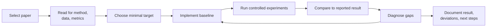
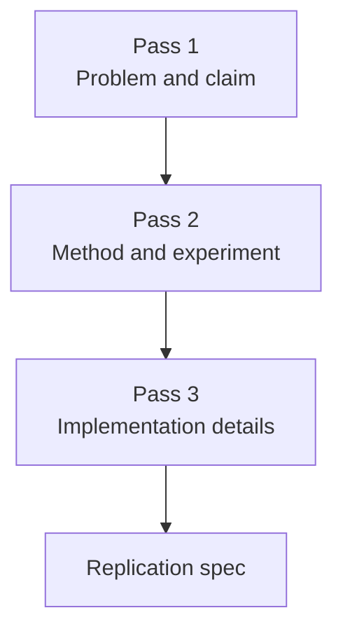
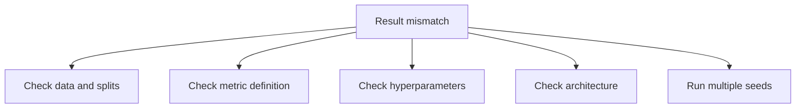

# Paper Replication

## Watch First

<div style={{position: 'relative', paddingBottom: '56.25%', height: 0, overflow: 'hidden', maxWidth: '100%', marginBottom: '1.5rem'}}>
  <iframe
    src="https://www.youtube.com/embed/H2K4L7pboS8"
    title="How to Read Machine Learning Research Papers"
    style={{position: 'absolute', top: 0, left: 0, width: '100%', height: '100%', border: 0}}
    allow="accelerometer; autoplay; clipboard-write; encrypted-media; gyroscope; picture-in-picture; web-share"
    referrerPolicy="strict-origin-when-cross-origin"
    allowFullScreen
  />
</div>

## Learning Objectives

By the end of this lesson, you will be able to:

- Explain why replication is central to ML research and engineering.
- Read a paper for implementation details, not only high-level ideas.
- Build a reproducible replication plan with seeds, configs, logs, and metrics.
- Decide what to reproduce first, what to simplify, and how to document deviations.

## Replication Workflow



Paper replication turns research from something you recognize into something you can operate.

You do not own an ML idea after reading the abstract. You start to own it when you can implement the core method, reproduce a meaningful result, explain deviations, and extend the work responsibly.

:::tip Launch Rule
A replication is successful when it is reproducible and informative. It does not have to match every number perfectly to teach you what matters.
:::

## What Replication Means

Replication can happen at different levels.

| Level | Goal | Example |
| --- | --- | --- |
| Conceptual | Rebuild the idea in a simpler setting | implement attention on toy data |
| Code-level | Run or adapt the authors' code | reproduce one reported table row |
| Experimental | Match a paper result under similar settings | same dataset, metric, split |
| Extension | Test a change after replication works | new dataset, ablation, or module |

For learning, start with conceptual or code-level replication. For research claims, you need experimental rigor.

## Choosing a Paper

Pick a paper with:

- clear task and metric,
- available code or enough detail to reimplement,
- accessible dataset,
- manageable compute,
- a method connected to your learning goals.

Good first replication targets:

- classic papers with many educational implementations,
- papers with strong documentation,
- small ablation studies,
- methods that can run on a laptop or modest GPU.

Avoid starting with a large foundation-model training paper unless your goal is to replicate a small component.

## Three-Pass Reading for Implementation



### Pass 1: What Is the Claim?

Answer:

- What problem is being solved?
- What is the main contribution?
- What does the paper compare against?
- Which result matters most?

### Pass 2: What Is the Method?

Extract:

- model architecture,
- objective function,
- data preprocessing,
- training schedule,
- evaluation metric,
- ablations.

### Pass 3: What Must Be True to Reproduce It?

Find:

- exact dataset split,
- random seeds,
- hidden defaults,
- optimizer settings,
- hardware assumptions,
- code release and license.

## Replication Spec

Before coding, write a short spec.

| Field | Example |
| --- | --- |
| Paper | Attention Is All You Need |
| Target result | BLEU score on translation task, or toy attention module |
| Dataset | WMT subset, or small synthetic sequence data |
| Metric | BLEU, accuracy, loss, MAE |
| Baseline | paper baseline or simpler model |
| Compute budget | local CPU, one GPU, or cloud budget |
| Success threshold | within tolerance, or qualitative behavior matches |
| Known simplifications | smaller model, fewer epochs, subset dataset |

The spec protects you from endless scope creep.

## Project Structure

Use a small, repeatable layout.

```text
paper-replication/
  README.md
  configs/
    baseline.yaml
  data/
    README.md
  src/
    model.py
    train.py
    evaluate.py
  runs/
    .gitkeep
  reports/
    replication-notes.md
```

Avoid burying the project inside one notebook. Notebooks are useful for inspection, but replication needs scripts and configs.

## Reproducibility Basics

Set seeds and log configuration.

```python
import json
import random
from pathlib import Path

import numpy as np

def set_seed(seed: int = 42) -> None:
    random.seed(seed)
    np.random.seed(seed)

def save_run_metadata(path: str, metadata: dict) -> None:
    output = Path(path)
    output.parent.mkdir(parents=True, exist_ok=True)
    output.write_text(json.dumps(metadata, indent=2), encoding="utf-8")

set_seed(42)

metadata = {
    "paper": "example-paper",
    "seed": 42,
    "dataset": "toy-v1",
    "metric": "accuracy",
    "learning_rate": 0.001,
    "notes": "minimal replication run",
}

save_run_metadata("runs/run_001/metadata.json", metadata)
```

For PyTorch or TensorFlow, also set framework-specific seeds and record package versions.

## Comparing Results

A replication result should compare against a target with tolerance.

```python
def compare_metric(name, reproduced, reported, tolerance):
    delta = reproduced - reported
    passed = abs(delta) <= tolerance
    return {
        "metric": name,
        "reported": reported,
        "reproduced": reproduced,
        "delta": delta,
        "tolerance": tolerance,
        "passed": passed,
    }

result = compare_metric(
    name="accuracy",
    reproduced=0.842,
    reported=0.850,
    tolerance=0.02,
)

print(result)
```

If you miss the target, diagnose before changing random things.

## Diagnosing Gaps

Common causes of mismatch:

- different data split,
- missing preprocessing,
- hidden hyperparameter defaults,
- different metric implementation,
- random seed instability,
- insufficient training time,
- architecture detail omitted from the paper,
- framework version differences.

Use ablations to isolate the issue:



## Replication Report

Write a concise report with:

- paper summary,
- exact target reproduced,
- implementation choices,
- results table,
- deviations from paper,
- suspected causes of mismatch,
- what you would extend next.

Example table:

| Run | Seed | Metric | Reported | Reproduced | Notes |
| --- | --- | --- | --- | --- | --- |
| 001 | 42 | accuracy | 0.85 | 0.842 | smaller batch size |
| 002 | 7 | accuracy | 0.85 | 0.831 | unstable split |

## Practical Exercises

### Exercise 1: Write a Replication Spec

Choose one paper and fill out the replication spec table.

### Exercise 2: Build the Skeleton

Create the project structure above and add a `README.md` that explains how to run the first experiment.

### Exercise 3: Run a Mini-Replication

Reproduce one small claim from a paper or tutorial, then write a report with deviations.

## Self-Assessment

Rate yourself from 1 to 5:

- I can choose a realistic paper to replicate.
- I can read a paper for implementation details.
- I can create a reproducible experiment structure.
- I can diagnose and document mismatched results.

## Further Reading

- [Papers with Code](https://paperswithcode.com/)
- [NeurIPS Paper Checklist Guidelines](https://neurips.cc/public/guides/PaperChecklist)
- [ML Reproducibility Challenge](https://paperswithcode.com/rc2022)

## Next Steps

Next, study large model alignment. Many alignment techniques come from papers; replication is how you learn which methods are real, transferable, and safe enough to adapt.
