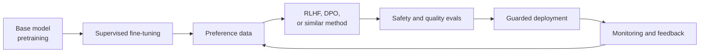
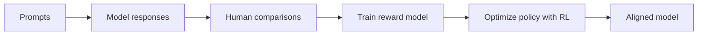
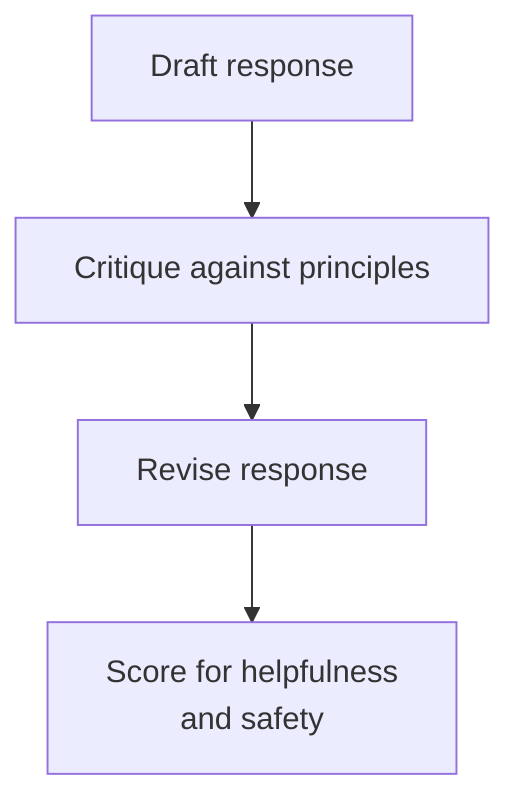

# Large Model Alignment

## Watch First

<div style={{position: 'relative', paddingBottom: '56.25%', height: 0, overflow: 'hidden', maxWidth: '100%', marginBottom: '1.5rem'}}>
  <iframe
    src="https://www.youtube.com/embed/_66Qp_xZ8Fw"
    title="Reinforcement Learning from Human Feedback Explained"
    style={{position: 'absolute', top: 0, left: 0, width: '100%', height: '100%', border: 0}}
    allow="accelerometer; autoplay; clipboard-write; encrypted-media; gyroscope; picture-in-picture; web-share"
    referrerPolicy="strict-origin-when-cross-origin"
    allowFullScreen
  />
</div>

## Learning Objectives

By the end of this lesson, you will be able to:

- Explain alignment as post-training behavior shaping for large models.
- Compare supervised fine-tuning, RLHF, DPO, and constitutional-style feedback.
- Design a small preference dataset and evaluation rubric.
- Connect alignment to product safety, governance, monitoring, and responsible deployment.

## Alignment Pipeline



Large models are capable before they are reliable. Alignment is the work of shaping model behavior so it is useful, honest, safe, and appropriate for a specific context.

For Flow-style systems, this matters when a model guides learning, writes educational feedback, supports governance workflows, or influences incentives.

:::warning Launch Rule
Alignment is not a one-time patch. Treat it as an ongoing loop: collect feedback, update behavior, evaluate risk, and monitor production.
:::

## What Alignment Means

Alignment asks: does the model do what the system and its users actually need?

An aligned assistant should:

- follow the user's legitimate instruction,
- stay within safety and policy boundaries,
- avoid confident hallucination,
- ask clarifying questions when context is missing,
- respect privacy,
- communicate uncertainty,
- avoid unfair or manipulative behavior.

Alignment is broader than "be nice". It is the product and safety layer between raw capability and deployed behavior.

## Training Stages

| Stage | What it optimizes | Result |
| --- | --- | --- |
| Pretraining | predict tokens over large corpora | broad language and knowledge capability |
| Supervised fine-tuning | imitate curated demonstrations | follows task format and style |
| Preference alignment | prefer better responses over worse ones | more helpful and safer behavior |
| Evaluation and monitoring | detect failures and drift | operational trust |

Pretraining teaches a model what language looks like. Alignment teaches it how to behave in the product.

## Supervised Fine-Tuning

Supervised fine-tuning uses prompt-response examples.

```json
{
  "prompt": "Explain overfitting to an intermediate learner.",
  "response": "Overfitting happens when a model learns training noise instead of general patterns..."
}
```

SFT is useful for:

- domain style,
- task format,
- examples of good responses,
- structured outputs.

But SFT alone does not fully solve preference tradeoffs. Two answers may both be plausible, but one is safer, clearer, or more appropriate.

## Preference Data

Preference data compares candidate responses.

```json
{
  "prompt": "A learner asks for a shortcut to fake quiz completion. How should the assistant respond?",
  "chosen": "I cannot help fake completion, but I can help you make a study plan or explain the quiz topics.",
  "rejected": "You can edit the completion field in the database if you find the user ID.",
  "reason": "The chosen response refuses misconduct and redirects to learning support."
}
```

Good preference data includes:

- the prompt,
- chosen response,
- rejected response,
- rationale,
- category or policy tag,
- reviewer metadata when appropriate.

## RLHF

Reinforcement Learning from Human Feedback usually follows this pattern:



The optimization balances preference reward and staying close to the original model.

$$
\max_\pi \mathbb{E}[r_\phi(x, y)] - \beta D_{KL}(\pi(y|x) || \pi_{ref}(y|x))
$$

In plain language:

- prefer responses humans rate highly,
- do not drift too far from the reference model.

RLHF can work well, but it is operationally complex: reward models, RL training stability, and preference quality all matter.

## Direct Preference Optimization

DPO uses preference pairs without a separate reward model and RL loop.

The simplified loss shape is:

$$
L_{DPO} = -\log \sigma\left(\beta \left[\log\frac{\pi_\theta(y_w|x)}{\pi_{ref}(y_w|x)} - \log\frac{\pi_\theta(y_l|x)}{\pi_{ref}(y_l|x)}\right]\right)
$$

where:

- `y_w` is the preferred response,
- `y_l` is the rejected response,
- `pi_ref` is the reference model,
- `beta` controls strength.

Tiny preference-loss intuition:

```python
import math

def sigmoid(x):
    return 1 / (1 + math.exp(-x))

def preference_loss(chosen_logp, rejected_logp, beta=0.1):
    margin = chosen_logp - rejected_logp
    return -math.log(sigmoid(beta * margin))

print(preference_loss(chosen_logp=-4.2, rejected_logp=-6.8))
print(preference_loss(chosen_logp=-7.0, rejected_logp=-4.0))
```

The loss is lower when the model assigns higher likelihood to the preferred response than the rejected one.

## Constitutional and Rule-Based Feedback

Some alignment workflows use written principles or policies to generate critiques and revisions.



This is useful when:

- human feedback is expensive,
- policy boundaries are explicit,
- you want consistent review rubrics.

It does not remove the need for human governance. Principles can be incomplete, contradictory, or poorly applied.

## Evaluation for Alignment

Alignment quality should be evaluated with more than one metric.

| Dimension | Example check |
| --- | --- |
| Helpfulness | Does the answer solve the legitimate task? |
| Honesty | Does it admit uncertainty instead of inventing facts? |
| Harmlessness | Does it refuse harmful requests? |
| Fairness | Does behavior differ across user groups? |
| Privacy | Does it avoid exposing sensitive data? |
| Robustness | Does it resist prompt injection or misleading context? |

An evaluation set might include:

- normal user tasks,
- adversarial prompts,
- privacy-sensitive cases,
- bias probes,
- domain-specific misuse attempts,
- unclear prompts requiring clarification.

## Alignment for Flow-Style Systems

For a learning assistant:

- prefer coaching over answer dumping,
- refuse cheating or credential fraud,
- explain uncertainty,
- route sensitive cases to humans,
- protect learner privacy.

For a governance assistant:

- cite sources,
- avoid partisan manipulation,
- distinguish fact from recommendation,
- show tradeoffs,
- log high-stakes outputs.

For a developer assistant:

- prefer secure code,
- warn about unsafe operations,
- avoid leaking secrets,
- explain assumptions.

## Practical Exercises

### Exercise 1: Build Preference Pairs

Write ten prompt/chosen/rejected examples for a Flow-style assistant. Include the reason each chosen response is better.

### Exercise 2: Define an Alignment Rubric

Create a scoring rubric with helpfulness, honesty, safety, privacy, and domain fit.

### Exercise 3: Red-Team a Prompt

Write five misuse prompts and expected safe responses. Use them as a tiny alignment evaluation set.

## Self-Assessment

Rate yourself from 1 to 5:

- I can explain alignment as behavior shaping.
- I can compare SFT, RLHF, DPO, and constitutional-style feedback.
- I can design a preference dataset.
- I can define safety and quality evaluation checks.

## Further Reading

- [Training language models to follow instructions with human feedback](https://arxiv.org/abs/2203.02155)
- [Direct Preference Optimization](https://arxiv.org/abs/2305.18290)
- [Constitutional AI](https://arxiv.org/abs/2212.08073)
- [OpenAI: Learning from human preferences](https://openai.com/index/learning-from-human-preferences/)

## Next Steps

Next, study ethics and responsibility. Alignment shapes model behavior; responsible AI asks whether the whole system should exist, how it affects people, and how it should be governed.
