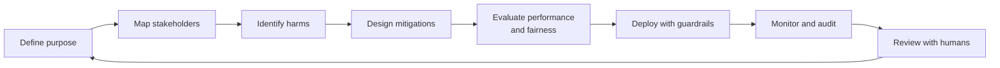
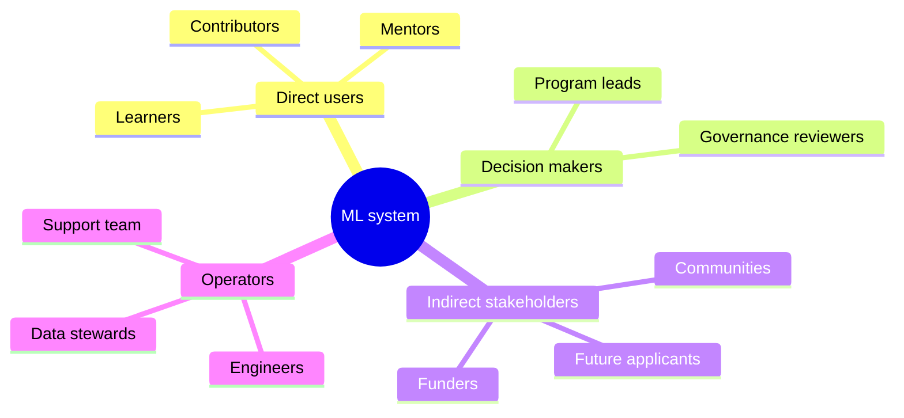
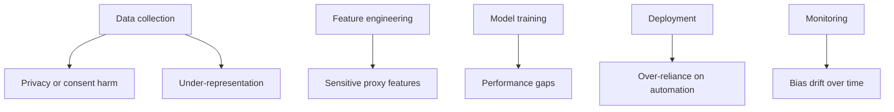
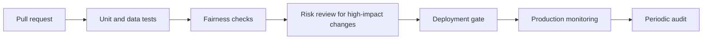

# Ethics and Responsibility

## Watch First

<div style={{position: 'relative', paddingBottom: '56.25%', height: 0, overflow: 'hidden', maxWidth: '100%', marginBottom: '1.5rem'}}>
  <iframe
    src="https://www.youtube.com/embed/i6G4K6KMLh4"
    title="A Crash Course on the AI Ethics Landscape"
    style={{position: 'absolute', top: 0, left: 0, width: '100%', height: '100%', border: 0}}
    allow="accelerometer; autoplay; clipboard-write; encrypted-media; gyroscope; picture-in-picture; web-share"
    referrerPolicy="strict-origin-when-cross-origin"
    allowFullScreen
  />
</div>

## Learning Objectives

By the end of this lesson, you will be able to:

- Treat ethics as an engineering practice, not a public-relations layer.
- Identify risks around fairness, privacy, transparency, accountability, and harm.
- Run a simple group-level fairness check.
- Connect responsible AI to alignment, monitoring, deployment, and governance.

## Responsible AI Loop



Responsible AI asks a simple but hard question:

> Who is affected by this system, and are we building it in a way that deserves their trust?

In Flow-style systems, models may shape learning paths, community governance, public-good funding, or contributor reputation. That makes ethics part of the product requirements.

:::warning Launch Rule
Do not launch high-impact ML without a risk owner, monitoring plan, user recourse path, and rollback or fallback behavior.
:::

## Core Principles

| Principle | Engineering question |
| --- | --- |
| Fairness | Does the system perform differently across groups? |
| Reliability and safety | Does it fail predictably and safely? |
| Privacy and security | Does it protect sensitive data? |
| Transparency | Can affected people understand the system's role? |
| Accountability | Who is responsible when harm occurs? |
| Human agency | Can people contest, override, or appeal decisions? |

Principles matter only when they become concrete checks, docs, and operating procedures.

## Stakeholder Mapping

Start by listing affected people and institutions.



For each group, ask:

- What benefit could they receive?
- What harm could they experience?
- What information do they need?
- How can they challenge or correct the system?

## Fairness Metrics

Fairness is contextual. No single metric solves all cases, but group-level checks reveal hidden gaps.

Demographic parity difference compares positive prediction rates:

$$
DPD = P(\hat{Y}=1|A=a) - P(\hat{Y}=1|A=b)
$$

Equal opportunity difference compares true positive rates:

$$
EOD = TPR_{A=a} - TPR_{A=b}
$$

Use these as investigation tools, not automatic verdicts.

## Fairness Check in Python

```python
import pandas as pd
from sklearn.metrics import accuracy_score, recall_score

data = pd.DataFrame({
    "group": ["A", "A", "A", "B", "B", "B", "B", "A"],
    "y_true": [1, 0, 1, 1, 0, 1, 0, 0],
    "y_pred": [1, 0, 0, 1, 1, 1, 0, 0],
})

summary = []

for group, rows in data.groupby("group"):
    summary.append({
        "group": group,
        "n": len(rows),
        "accuracy": accuracy_score(rows["y_true"], rows["y_pred"]),
        "positive_prediction_rate": rows["y_pred"].mean(),
        "recall": recall_score(rows["y_true"], rows["y_pred"]),
    })

report = pd.DataFrame(summary)
print(report)

dpd = (
    report.loc[report["group"] == "A", "positive_prediction_rate"].iloc[0]
    - report.loc[report["group"] == "B", "positive_prediction_rate"].iloc[0]
)

eod = (
    report.loc[report["group"] == "A", "recall"].iloc[0]
    - report.loc[report["group"] == "B", "recall"].iloc[0]
)

print({"demographic_parity_difference": dpd, "equal_opportunity_difference": eod})
```

This does not prove fairness. It starts the investigation.

## Sources of Harm

ML harms can appear at every stage.



Common risks:

- data collected without clear consent,
- sensitive attributes stored unnecessarily,
- proxies for protected attributes,
- labels reflecting past discrimination,
- no appeal process,
- opaque scoring,
- automation bias,
- models used outside intended context.

## Privacy and Data Minimization

Responsible systems collect the least sensitive data needed for the task.

Ask:

- Do we need this field?
- Can it be aggregated or anonymized?
- Who can access it?
- How long should it be retained?
- Could it expose vulnerable users if leaked?

For learner-support systems, avoid collecting sensitive personal history unless it is clearly necessary, consented, protected, and governed.

## Transparency and Recourse

A model does not need to expose every weight to be transparent. People need to understand:

- when a model is used,
- what decision it supports,
- what data categories influence it,
- what limitations exist,
- how to appeal or correct errors.

For high-impact systems, provide a human path. A learner should not be trapped by an automated label.

## Responsible Deployment Checklist

Before launch, document:

- intended use,
- out-of-scope use,
- stakeholders,
- known risks,
- evaluation metrics,
- subgroup metrics,
- data sources,
- privacy controls,
- monitoring plan,
- fallback behavior,
- escalation owner,
- review schedule.

This can become a lightweight model card.

## Ethics in CI/CD and Monitoring

Responsible AI should show up in engineering workflows.



Examples:

- fail a build if required data documentation is missing,
- warn if subgroup recall drops below a threshold,
- require review before deploying a model that affects user access,
- monitor fairness metrics over time.

## Practical Exercises

### Exercise 1: Stakeholder Map

Pick a model and map direct users, indirect stakeholders, operators, and decision makers.

### Exercise 2: Run the Fairness Check

Run the Python example, then add another group or metric. Explain what the result suggests and what it does not prove.

### Exercise 3: Write a Model Card Draft

Create a one-page model card with intended use, limitations, data, metrics, risks, and contact owner.

## Self-Assessment

Rate yourself from 1 to 5:

- I can explain why ethics is part of ML engineering.
- I can identify fairness, privacy, transparency, and accountability risks.
- I can compute simple subgroup metrics.
- I can connect responsible AI to CI/CD, deployment, monitoring, and alignment.

## Further Reading

- [NIST AI Risk Management Framework](https://www.nist.gov/itl/ai-risk-management-framework)
- [Microsoft Responsible AI principles](https://www.microsoft.com/en-us/ai/principles-and-approach)
- [Fairlearn documentation](https://fairlearn.org/)
- [Model Cards for Model Reporting](https://arxiv.org/abs/1810.03993)
- [Datasheets for Datasets](https://arxiv.org/abs/1803.09010)

## Next Steps

Use this lesson as a checklist for every advanced ML system you build. Capability without responsibility is not launch-ready.
